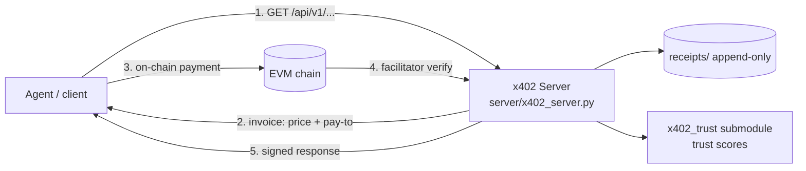

# Wintergreen x402 Content Broker

**A production micro-payment API broker built on the [x402](https://x402.org) protocol — quant research, AI prompts, and edge data sold per-request with on-chain settlement.**

Live at **[x402.wintergreen.uk](https://x402.wintergreen.uk)** · Brokered under the [x402scan](https://x402scan.com) Bazaar listing.

> Payments are real. The broker accepts live x402 payments (ETH/USDC via Coinbase Developer Platform facilitators), serves paid content, and appends every transaction to an immutable receipt log.

## What it does

x402 is a payment protocol for AI agents: an agent requests an endpoint, gets a priced invoice, pays on-chain, and receives the resource. This broker is a full reference implementation of the **merchant side**:

1. **Discovery** — free catalog + `/.well-known/x402` fan-out so agent crawlers find the storefront.
2. **Pricing** — per-endpoint invoices ($0.01–$0.25) enforced at the protocol layer.
3. **Settlement** — CDP facilitator JWT auth, on-chain payment verification, idempotent fulfillment.
4. **Content** — quant methodologies, AI prompt packs, and live edge-data endpoints.
5. **Receipts** — every paid interaction appended to `receipts/` (append-only, probe history + settlement log).
6. **Trust** — the `x402_trust` submodule computes independent, verifiable trust scores for endpoints.

## Architecture



**Live endpoint surface** (see module docstring for full list):

| Endpoint | Price | Type |
|----------|-------|------|
| `/` `/api/v1/catalog` `/health` | free | Discovery / ops |
| `/.well-known/x402` | free | Bazaar fan-out |
| `/api/v1/search` | $0.01 | Search |
| `/api/v1/prompts/{id}` | $0.05 | Single prompt |
| `/api/v1/prompts/category/{c}` | $0.10 | Category bundle |
| `/api/v1/prompts/pack` | $0.25 | Full methodology pack |
| `/api/v1/quant/*` | $0.01–$0.02 | Live edge-data endpoints |

## Tech Stack

| Layer | Technology |
|-------|-----------|
| Payment protocol | [x402](https://github.com/BuildersGuild/x402) (`x402[fastapi,evm]`) |
| Server | Python FastAPI + uvicorn |
| Settlement | Coinbase Developer Platform facilitators (JWT auth, per-endpoint keys) |
| Storage | JSON receipt logs + trust score store |
| Submodule | [x402-trust](https://github.com/wintergreen-ventures/x402-trust) (PyPI-published trust scoring) |

## Setup

### Prerequisites

- Python 3.11+
- An EVM wallet with funds for gas (merchant)
- CDP facilitator credentials (optional — graceful fallback to free mode)

### Run locally

```bash
git clone --recurse-submodules https://github.com/wintergreen-ventures/x402-content-broker.git
cd x402-content-broker

pip install "x402[fastapi,evm]" uvicorn

# Configure (never commit these)
cp .env.example .env
#   X402_PAY_TO=0x<your_wallet>
#   X402_PUBLIC_URL=http://localhost:8000
#   CDP_API_KEY_NAME=...
#   CDP_API_KEY_PRIVATE_KEY=...

python server/x402_server.py
```

Verify:

```bash
curl http://localhost:8000/health
curl http://localhost:8000/.well-known/x402
```

## Repository Layout

```
├── server/
│   ├── x402_server.py       # FastAPI app: catalog, payment flow, fulfillment
│   ├── quant_handlers/      # paid quant edge-data endpoints
│   ├── quant_live.py        # live edge computation
│   ├── weather_edge.py      # weather forecast edge endpoints
│   ├── polymarket_edge.py   # Polymarket signal endpoints
│   ├── mcp_server.py        # MCP adapter (agent tools)
│   ├── trust_endpoints.py   # trust score API
│   └── static/              # landing, pay, trust, agent-card, llms.txt
├── scripts/
│   ├── start_x402.py        # production launcher
│   ├── payment_simulator.py # offline payment simulation
│   ├── probe_harness.py     # end-to-end agent probe
│   └── restart_x402.py      # watchdog restart
├── receipts/                # append-only settlement + probe history
├── content/                 # prompt packs + methodology catalog
├── telemetry/               # usage metrics
├── marketing/               # storefront assets
└── x402_trust/              # submodule → x402-trust
```

## Receipt Discipline

Every paid interaction is appended to `receipts/probe_history.jsonl` and the
settlement log — timestamps, endpoint, price, and payment IDs. The repo
treats receipts as append-only evidence; `receipts/settle-log.jsonl` is
gitignored (contains live payment data).

## License

MIT — see [LICENSE](LICENSE). The `x402_trust` submodule has its own MIT
license ([x402-trust](https://github.com/wintergreen-ventures/x402-trust)).
